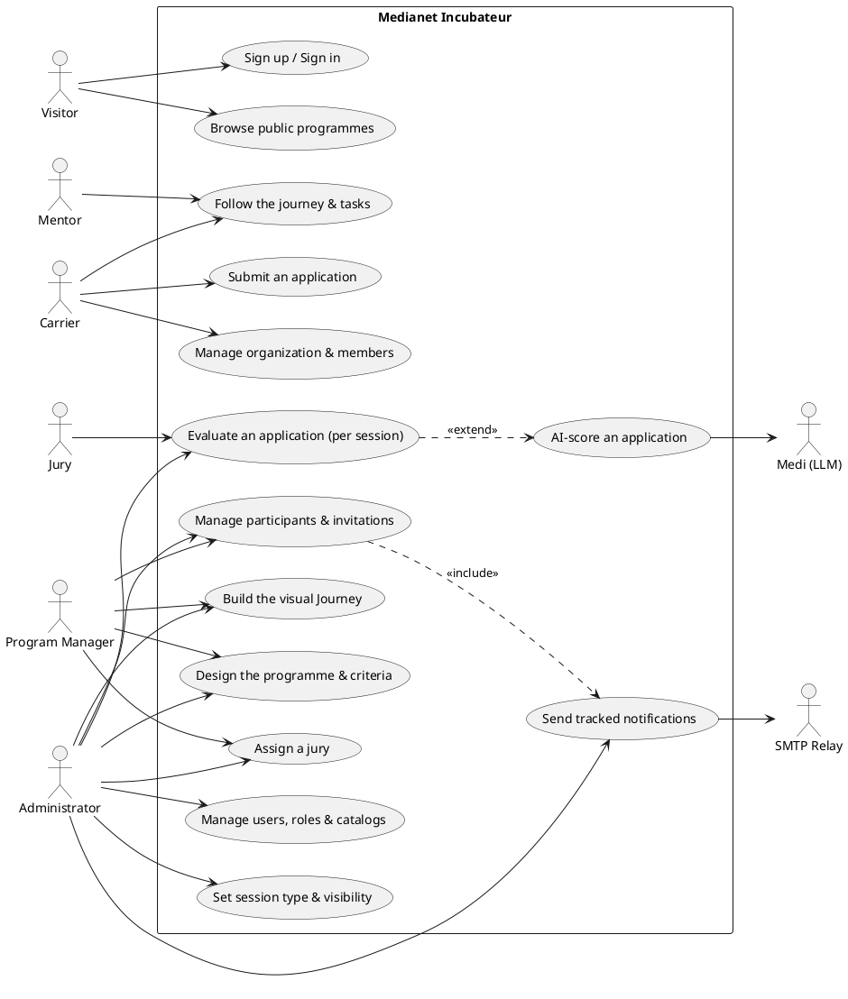
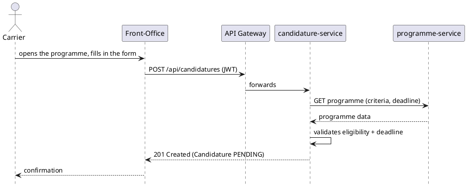
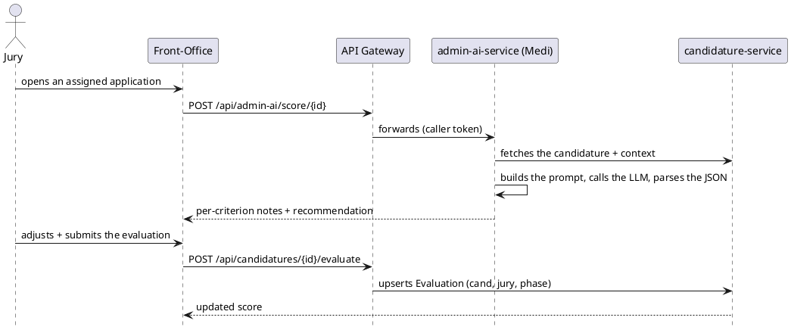
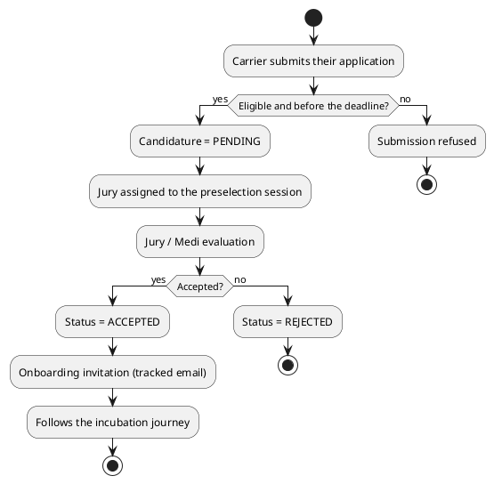
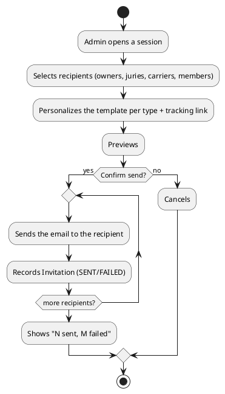
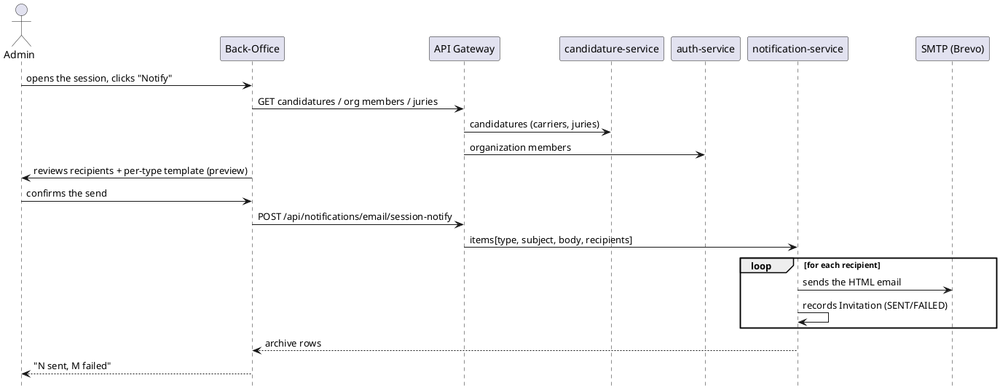
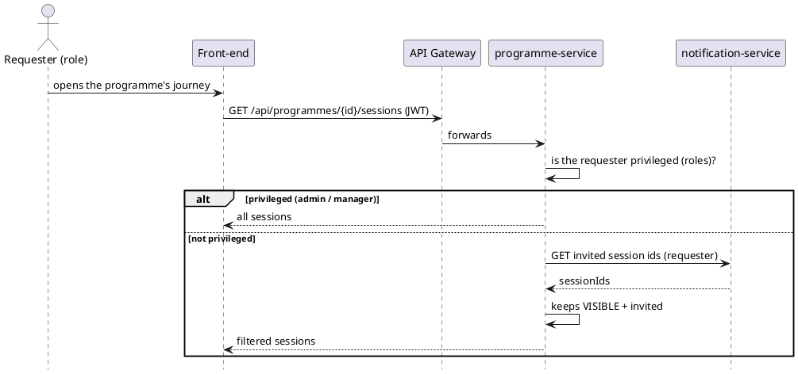
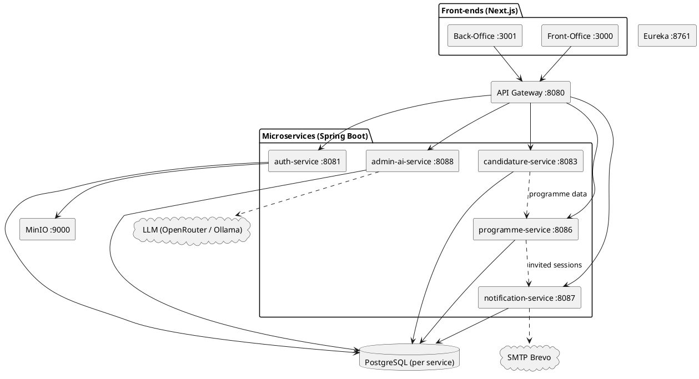
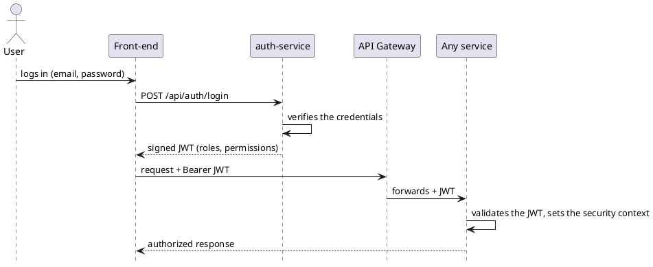

# Dedication

To my parents, for their unconditional support and everything they sacrificed along the way,

To my teachers, who passed on their knowledge with patience and rigor,

To my friends and colleagues, for their encouragement and their presence,

To everyone who, directly or indirectly, contributed to this work,

I dedicate this modest achievement.

— [Your name]

---

# Acknowledgements

I would first like to thank **[Medianet]** for welcoming me and giving me the opportunity to carry out this end-of-studies project in a genuinely stimulating professional environment.

My sincere thanks go to my company supervisor, **[Company supervisor's name]**, for their availability, their sound advice, and the rigorous follow-up they provided throughout this internship.

I would also like to thank my academic supervisor, **[Academic supervisor's name]**, for their methodological guidance, their constructive feedback, and their availability despite a busy schedule.

I address my thanks to the members of the jury for the honor they do me by agreeing to evaluate this work.

Finally, I thank the entire teaching staff of **[ESPRIT]** for the quality of the training I received during my studies, as well as my family and friends for their constant support.

---

# General Introduction

The digital economy has turned the **startup** into a central engine of value creation and employment, and **incubators** into the institutions tasked with supporting projects from idea to market. In Tunisia, the adoption of the *Startup Act* and the growing number of incubation and acceleration structures have pushed up, year after year, the number of programs that need to be managed. Each program involves a fairly complex choreography of actors and events: a call for applications, the intake and screening of files, the formation of juries, preselection and pitch sessions, the onboarding of the startups selected, several months of mentoring and training, and finally a demo day in front of investors.

There's something paradoxical about it, though: these same incubators, who help startups through their own digital transformation, mostly run their own programs in a fairly **artisanal** way — application forms scattered across third-party tools, selection grids kept in spreadsheets, juries contacted by email, agendas kept by hand, communications lost somewhere in an inbox. The result: the process slows down, mistakes pile up, consolidating results becomes a chore, and there's barely any traceability — right when funders and partners are asking for transparency and measurable outcomes.

It's in this context that this end-of-studies project was carried out, at **[Medianet]**: to **design and develop an integrated platform for managing incubation programs**, called **Medianet Incubateur**. The idea is to give program managers a single, coherent, and secure environment to design a program, receive and evaluate applications, run the sessions of its *journey* (or *parcours*), and manage — while keeping informed — everyone involved. Project carriers, juries, and the general public, for their part, each get an access experience suited to their role.

This project isn't just a matter of digitizing existing practices; it introduces a few ideas that genuinely shape the solution. First, a **unified, extensible session model**, capable of representing any stage of a program — application, preselection, pitch day, onboarding, incubation, demo day, training — without ever touching the database schema. Then, a **visibility** dimension that distinguishes public, internal, and private sessions. A **centralized validation layer**, too, which guarantees date consistency and the integrity of the journey. And finally, an **AI-assisted evaluation** that helps juries score applications more objectively, against the criteria specific to each program.

The central problem this project tries to solve can be put as a single question: *how do you design a single platform capable of modeling an incubation program as a structured, visual journey of typed, access-controlled sessions, while guaranteeing data reliability, role-based access security, and communication traceability?*

Four chapters make up the rest of this report. **Chapter 1** lays out the general framework — host organization, existing solutions, the proposed answer, the development methodology behind it. **Chapter 2** turns that into requirements: actors, use cases, functional and non-functional needs, with the major use cases worked out in detail through dynamic diagrams. **Chapter 3** is where the object-oriented design takes shape — class diagram, data dictionary, sequence diagrams, component diagram. And **Chapter 4**, the last one, is about what actually got built: the work environment, the architecture, the interfaces, the test dataset, the planning, and the difficulties that came up along the way. A general conclusion closes things out and points toward what could come next.

---

# Chapter 1 — General Framework

## Introduction

Before getting into the platform itself, it's worth setting the scene. This chapter walks through the host organization, the problem the internship was meant to address, and an early look at what got built — followed by a look at what's already out there, both in Tunisia and beyond, and why it falls short. It ends with the development methodology chosen, and why it won out over the alternative.

## 1.1 Host Organization

### 1.1.1 General Presentation

**[Medianet]** is a **[Tunisian company specializing in digital services, web, and software solutions]**. Since it was founded in **[year]**, the company has supported both public and private organizations in their digital transformation, notably through **[web development, hosting, digital marketing, e-business, and software engineering]**.

```figure
Figure 1.1 — Host organization logo
[Insert the Medianet logo]
```

> To complete with your supervisor: exact legal form, year founded, head office address, headcount, main lines of business, reference clients.

The table below summarizes the key facts about the host organization.

| Item | Value |
|------|-------|
| Company name | [Medianet] |
| Legal form | [PLC / LLC] |
| Year founded | [year] |
| Head office | [Tunis, Tunisia] |
| Industry | [Digital services / Web / Software] |
| Main activities | [Web, hosting, digital marketing, software engineering] |
| Headcount | [number] employees |
| Website | [www.example.tn] |

Table 1.1 — Host organization fact sheet

### 1.1.2 Fields of Activity

Concretely, the host organization is active in several areas:

- **[Web development and custom applications]** for public and private clients ;
- **[Hosting and managed services]** for digital solutions ;
- **[Digital marketing]** and support for online presence ;
- **Innovation support**, in particular helping structure incubation and acceleration programs — precisely the setting this end-of-studies project fits into.

### 1.1.3 Company Organization

```figure
Figure 1.2 — Host organization chart
[Insert the company's organization chart]
```

Figure 1.2 shows the company's organization chart. It's structured into several departments, one of which hosted this end-of-studies project.

### 1.1.4 Host Department

The internship took place within the **[software engineering / innovation]** department, under the supervision of **[Company supervisor's name]**. This is the team that designs and builds the company's web applications, both for internal use and for its clients.

The table below summarizes the administrative framework of the internship.

| Item | Value |
|------|-------|
| Nature | End-of-studies project |
| Duration | [4 to 6] months |
| Period | [start] – [end] |
| Academic supervisor | [Name] |
| Company supervisor | [Name] |
| Specialization | [Software Engineering / Computer Science] |

## 1.2 Project Overview

This project consists of designing and developing **Medianet Incubateur**, a web platform whose purpose is to digitize the entire lifecycle of a startup incubation program. It brings together, in a single tool adapted to each role, the visual design of a program as a journey of typed, visibility-controlled sessions, online applications, jury evaluation assisted by artificial intelligence, the management of participants and organizations, and communications that can actually be tracked.

```figure
Figure 1.3 — Overview of the proposed solution
[Insert a summary diagram or a screenshot of the main dashboard]
```

As shown in Figure 1.3, the solution rests on two distinct interfaces: a **back-office**, built for administrators and program managers, and a **front-office** aimed at project carriers, juries, organization members, and, more broadly, the general public.

## 1.3 Study of the Existing Landscape

### 1.3.1 Description of Existing Practices

Whether at the host organization or at comparable players in the Tunisian ecosystem, the management of incubation programs still largely relies on a patchwork of generic tools:

- application forms built with third-party tools, such as Typeform or Google Forms ;
- selection and scoring grids that live in spreadsheets (Excel, Google Sheets) ;
- agendas kept by hand in shared calendars ;
- communications handled by email and instant messaging, with no real centralized archive ;
- progress reports that have to be recalculated manually for every review.

That's the case for several Tunisian incubators — **Flat6Labs Tunis**, **Wiki Start Up**, **B@Labs (BIAT)**, **Impact Partner**, **The Dot**, **Redstart Tunisie** — which publish their calls for applications and run their cohorts in a fairly similar way: a presentation page, an external form, and follow-up that stays manual internally. The national **Startup Tunisia / Startup Act** portal follows a different logic, since it focuses on the legal labeling of startups rather than on the operational management of a program's journey.

The table below compares, feature by feature, what these solutions typically cover against what this project aims for.

| Feature | Generic incubator portals | National labeling portal | Medianet Incubateur |
|---------|----------------------------|----------------------------|----------------------|
| Public program presentation | Yes | Partial | Yes |
| Online application form | Yes (often external) | No | Yes (per program) |
| Visual program journey | No | No | Yes |
| Typed sessions with activities | No | No | Yes |
| Session visibility control | No | No | Yes |
| Jury evaluation (weighted criteria) | Rare / external | No | Yes |
| AI-assisted scoring | No | No | Yes |
| Participant directory & tracked invitations | Partial | No | Yes |
| Multi-role access (admin/jury/carrier) | Partial | Partial | Yes |

Table 1.2 — Comparison of competing Tunisian offerings

### 1.3.2 Critique of the Existing Landscape

This analysis of the existing landscape brings out a few weaknesses that keep coming up:

- **Fragmented tooling.** Applications, the selection grid, jury scoring, the agenda, and communications each live in their own corner — separate files, different inboxes. Nothing is centralized, and the same data keeps getting copied back and forth between tools.
- **No single source of truth for the journey.** The program's calendar — its sessions, their order, their nesting (a training day slipped inside an incubation period), their dependencies — isn't modeled anywhere. In practice, it only exists in the program manager's head and in a handful of scattered documents.
- **Manual, non-reproducible evaluation.** Juries are contacted by email, receive applications as attachments, then score them on paper or in improvised spreadsheets. Consolidating weighted scores by criterion, by jury, and by session quickly becomes tedious — and re-evaluating the same candidate in a later session, a pitch day following a preselection for instance, is even harder.
- **Weak, informal access control.** Some sessions are purely internal — planning, jury deliberation, score recalibration — and should never be visible to startups or the public. Yet nothing structurally prevents it. Conversely, an external jury invited to a single private session shouldn't, in theory, get access to the rest of the program.
- **Insufficient traceability of communications.** When a manager sends an invitation or an update, there's no reliable record of who was contacted, when, with what message, or even whether the email actually reached its destination.
- **No consolidated metrics.** Funnel metrics (applications received, evaluated, accepted), jury progress, sector breakdown, or the ranking of top candidates — all of this has to be recalculated by hand for every report.

Add it all up and these weaknesses carry a real cost: **time lost** on repetitive manual tasks, **errors** in transcription and score consolidation, **delays** in decisions, a certain **frustration** among juries and project carriers facing a process they don't really control, and a lot of **difficulty** producing the transparent reporting that funders and partners expect.

## 1.4 Proposed Solution

Starting from these observations, the proposed solution takes the form of a **single, secure web platform**, capable of:

- modeling a program as a structured, visual journey of typed sessions ;
- receiving and managing applications online ;
- supporting reproducible, per-session jury evaluation, assisted where relevant by artificial intelligence ;
- managing every participant and organization, and communicating with them in a traceable way ;
- strictly enforcing business rules — date validation, session visibility — both server-side and in the interface ;
- clearly distinguishing roles: administrator, program manager, project carrier, jury, mentor, and general public.

The following chapters go through each of these pillars in turn: the visual journey builder, typed and visibility-controlled session management, online applications, AI-assisted evaluation (nicknamed « **Medi** »), participant management with tracked invitations, and administrable reference catalogs.

## 1.5 Development Methodology

Choosing the right development methodology matters just as much as everything else, especially for a project whose requirements keep evolving along the way. Before justifying the choice made, this section briefly presents two reference approaches.

### 1.5.1 The Waterfall Cycle

The **waterfall** model moves sequentially: each phase — specification, design, implementation, testing, deployment — has to be finished before moving on to the next. When requirements are locked in from the start, that predictability is a real asset. But as soon as requirements get refined along the way, the model shows its limits, since going back becomes costly.

### 1.5.2 Agile Methods (Scrum)

**Agile** methods — **Scrum** being the best known — work quite differently: development is broken down into **short iterations**, sprints, each delivering a functional increment that gets reviewed with stakeholders before moving on to the next. Adapting to requirements becomes continuous, problems surface earlier, and collaboration between developers and business stakeholders tightens up.

### 1.5.3 Methodology Chosen

For this project, **the requirements weren't fully known upfront** — they became clearer as the work progressed. The session model, the visibility rules, the evaluation flow: each of these matured over several iterations, in discussion with the host organization. A waterfall cycle, which assumes everything is locked down from day one, simply wouldn't have fit that reality. That's why an **agile, iterative, incremental approach** was chosen instead: the work moves forward in short increments, each delivering a coherent, deployable vertical slice — back-end and front-end together — continuously integrated and validated before moving on.

**UML**, for its part, is used throughout the project as a **design and communication aid**: it helps clarify actors, use cases, the domain model, and the main dynamic flows, without ever trying to lock down an exhaustive specification upfront. This lightweight, model-driven agility is close in spirit to the **Two-Track Unified Process (2TUP)** and to **Scrum** practices.

The table below summarizes this comparison.

| Criterion | Waterfall | Scrum (chosen) |
|-----------|-----------|-----------------|
| Adaptation to evolving requirements | Low | High |
| Value delivery | At the end of the project | At every iteration |
| Risk of costly rework | High | Low |
| Suited to still-uncertain requirements | No | Yes |

Table 1.3 — Comparison of development methodologies

Concretely, the approach adopted rests on the following points:

- **Product backlog.** Requirements are expressed as **user stories** per actor, then prioritized.
- **Increments / sprints.** Each increment targets a coherent set of user stories — first the program builder, then applications, evaluation, AI scoring, visibility, and finally participants.
- **Continuous integration and delivery.** Every change goes through static typing (`tsc`), a build (`mvn` or Next.js build), and deployment as containers (`docker compose build` / `up`).
- **Microservice isolation.** Each business context is developed and deployed independently, with its own database.
- **Verification.** Manual test scenarios and end-to-end checks accompany every increment, systematically covering each session type and each role.

## Conclusion

So that's the backdrop: a host organization, a problem that turned out to be real rather than invented, an early sketch of the platform, and the methodology behind how it got built. From here, the next step is turning that sketch into requirements. That's where Chapter 2 picks up.

---

# Chapter 2 — Requirements Analysis and Specification

## Introduction

Turning a vision into something buildable means writing it down precisely. That's the job of this chapter: functional and non-functional requirements, the actors involved, the use cases they trigger, and — for the ten that matter most — a full breakdown through textual descriptions, system sequence diagrams, and activity diagrams.

## 2.1 Project Vision

The vision behind **Medianet Incubateur** fits in a few lines:

> Give incubators a single platform that turns a program into a **structured, visual journey** of typed, access-controlled sessions; lets candidates **apply online**; lets juries **evaluate** (assisted by artificial intelligence); and keeps every participant **informed** through traceable communications — all while guaranteeing **strict data validation** and a **clear separation of roles**.

### 2.1.1 Functional Requirements

For clarity, functional requirements have been grouped by module.

**M1 — Authentication and Accounts**
- Sign-up and sign-in with **JWT** ; password reset.
- User profile management, differentiated by role (carrier, jury, mentor).
- Administration of users, their **roles**, and their **fine-grained permissions**.

**M2 — Programmes and Journeys**
- Create, view, update, and delete programmes, along with their metadata (title, description, type, dates, sectors, eligible organization types, key figures, partners) and a **customizable application form**.
- Manage **evaluation criteria** (name, weight, maximum score) per programme.
- Build the visual **journey**: create **sessions** (day or range), **nest** day-sessions inside ranges, organize them into **lanes**, define their **type**, **visibility**, **dates**, **location**, **owners** and **guests**, and set **per-session criteria weights**.
- Edit an **activity agenda** (hourly grid) for day-sessions ; reuse **presets** and full **journey templates**.
- **Automatically synchronize the programme status** based on the dates and statuses of its sessions.

**M3 — Applications**
- Submit an application to an open programme through the programme's own form, linking the carrier's **organization** and **team**.
- Manage an application's **status lifecycle** (pending, under evaluation/review, accepted, rejected).
- View the **full detail** of an application, including the answers submitted.

**M4 — Evaluation**
- **Assign juries** to an evaluation session.
- **Score** an application against weighted criteria ; allow **re-evaluation per session** (a candidate is scored afresh in every evaluation session).
- Run an **AI score (Medi)** producing per-criterion notes, a weighted score, a recommendation, and a summary ; let administrators score as well.
- Provide a **consolidated dashboard** with ranking and export.

**M5 — Participants and Communications**
- List the **people associated** with a programme (organizations, members, carriers, juries).
- **Add already-registered users** or **invite people by email**.
- Compose a **personalized invitation** from a template with placeholders and a **tracking link** ; **preview before sending**.
- Send **per-session notifications** to the relevant participants and keep a **full archive** of every send.

**M6 — Visibility and Access Control**
- Set a session's **visibility**: **Visible**, **Hidden (internal)**, or **Private**.
- **Enforce** visibility server-side based on the requester's **role** and **invitations**, and reflect it in the interface.

**M7 — Reference Catalogs**
- Manage **catalogs** (organization types, programme sectors, session types) used by the forms.

### 2.1.2 Non-Functional Requirements

| Quality | Requirement |
|---------|-------------|
| Security | Stateless **JWT** authentication at the gateway and in each service ; **role** and **permission** authorization (`module:action`) ; role-based data filtering, notably for session visibility. |
| Scalability | Independent, stateless **microservices** behind a gateway with service discovery ; **one database per service**. |
| Maintainability & extensibility | Well-scoped business contexts ; DTO layers ; a **centralized validation layer** with explicit error codes ; an **extensible session model** (new types without schema rework). |
| Usability | Two dedicated interfaces ; a readable, **tabbed** session interface (details first, activities kept separate) ; **confirmation before adding** and **preview before editing** for sensitive actions. |
| Performance | Lazy loading, **parallelized** requests, no **N+1** cross-service calls thanks to denormalized display fields. |
| Reliability | **Resilient** cross-service calls (graceful degradation), structured error handling, reproducible deployments. |
| Portability | Fully **containerized** solution (Docker), configuration driven by environment variables. |
| Localization | French-language interface, adapted to the local context. |

## 2.2 Requirements Specification

### 2.2.1 Identification of Actors

An **actor** is a role played by a user, or by an external system, that interacts with the platform.

| Actor | Type | Description |
|-------|------|-------------|
| Administrator | Human (primary) | Full control over programmes, journeys, criteria, applications, evaluations, users, roles, catalogs, and communications. |
| Program Manager | Human | A restricted administrator, scoped by permission slugs (`programmes:*`, `candidatures:*`, …) to a programme's operations. |
| Project Carrier (Porteur) | Human (primary) | Founder who applies to programmes, manages their organization, and follows the journey and their tasks. |
| Jury | Human (primary) | Evaluates the applications assigned to them, per evaluation session, optionally assisted by AI. |
| Mentor | Human | Supports the selected startups ; views the sessions and tasks assigned to them. |
| Organization Member | Human | Member of a participating organization ; follows programme updates. |
| Visitor | Human | Anonymous user who browses public programmes and the public journey (Visible sessions only). |
| Medi (LLM) | External system | The AI service that scores applications. |
| SMTP Relay (Brevo) | External system | Delivers invitation and notification emails. |

Table 2.1 — Identification of actors

### 2.2.2 Identification of Use Cases

The diagram below summarizes how these actors interact with the platform.



```figure
Figure 2.1 — Global use case diagram
[Insert the rendered use case diagram]
```

Figure 2.1 shows the full set of use cases. Ten of them were selected for detailed specification ; they are listed in Table 2.2.

| Code | Use Case | Primary Actor |
|------|-----------|----------------|
| UC-1 | Authenticate | All registered actors |
| UC-2 | Submit an application | Carrier |
| UC-3 | Design a programme and its criteria | Administrator |
| UC-4 | Build the visual Journey | Administrator |
| UC-5 | Set a session's type and visibility | Administrator |
| UC-6 | Assign a jury | Administrator |
| UC-7 | Evaluate an application (per session) | Jury |
| UC-8 | AI-score an application | Jury / Administrator |
| UC-9 | Manage participants and send invitations | Administrator |
| UC-10 | Follow a programme | Carrier / Jury |

Table 2.2 — List of major use cases

## 2.3 Detailed Requirements Specification

### 2.3.1 Textual Description of Major Use Cases

**UC-1 — Authenticate**

| Field | Description |
|-------|-------------|
| Actors | All registered actors |
| Goal | Obtain an authenticated session (JWT) to access role-protected features. |
| Preconditions | The user has an account. |
| Postconditions | A signed JWT is issued and stored ; the user is redirected to their dashboard. |
| Main flow | 1. The user opens the login page. 2. They enter their email and password. 3. The system validates the credentials. 4. The authentication service issues a JWT containing the user's roles and permissions. 5. The front-end stores the token and loads the appropriate workspace. |
| Alternatives | 3a. Invalid credentials → an error message is shown. |
| Exceptions | The authentication service is unavailable → a technical error is displayed. |

**UC-2 — Submit an Application**

| Field | Description |
|-------|-------------|
| Actors | Carrier |
| Goal | Apply to an open programme. |
| Preconditions | The programme is open (its application session is active and the deadline hasn't passed) ; the carrier is authenticated. |
| Postconditions | A `Candidature` is created with status *PENDING* and linked to the carrier's organization. |
| Main flow | 1. The carrier opens the programme page. 2. They start an application and fill in the programme's own form. 3. They link or create their organization and team. 4. They submit. 5. The system checks eligibility and the deadline, creates the application, and confirms. |
| Alternatives | 5a. The deadline has passed → submission is refused. 5b. Required fields are missing → validation errors are returned. |
| Exceptions | The candidature service is unavailable → the submission isn't recorded and the user is notified. |

**UC-3 — Design a Programme and Its Criteria**

| Field | Description |
|-------|-------------|
| Actors | Administrator, Program Manager |
| Goal | Create and configure a programme and its evaluation criteria. |
| Preconditions | The actor is authenticated and authorized (`programmes:update`). |
| Postconditions | The programme and its criteria are persisted. |
| Main flow | 1. The actor creates a programme and fills in its information (dates, sectors, eligible organization types, key figures). 2. They define the application form. 3. They add weighted evaluation criteria. 4. They save. |
| Alternatives | 1a. Dates are inconsistent → a validation error is returned. |
| Exceptions | — |

**UC-4 — Build the Visual Journey**

| Field | Description |
|-------|-------------|
| Actors | Administrator, Program Manager |
| Goal | Model the programme as a sequence of sessions and activities. |
| Preconditions | The programme exists ; the actor is authorized. |
| Postconditions | The sessions, their nesting, and their activities are persisted ; the programme status may be recomputed. |
| Main flow | 1. The actor adds a session (day or range). 2. They set its type, visibility, dates, location, and participants. 3. They optionally nest a day-session inside a range. 4. They add an activity agenda to a day-session. 5. The **validation layer** checks the dates, overlaps, and activity constraints. 6. The actor confirms the creation and previews sensitive edits. |
| Alternatives | 5a. A date violates a rule → an explicit error code is returned (e.g. SESSION_OVERLAP_DETECTED). 5b. Moving a range would push a nested day outside of it → the nested days are carried along once confirmed. |
| Exceptions | — |

**UC-5 — Set a Session's Type and Visibility**

| Field | Description |
|-------|-------------|
| Actors | Administrator |
| Goal | Define a session's type and who can see it. |
| Preconditions | The session exists. |
| Postconditions | The type and visibility are persisted ; visibility is enforced server-side. |
| Main flow | 1. The actor opens the session. 2. They pick a type (application, preselection, pitch day, …). 3. They pick a visibility (Visible / Internal / Private). 4. They save ; the change is previewed beforehand. |
| Alternatives | — |
| Exceptions | — |

**UC-6 — Assign a Jury**

| Field | Description |
|-------|-------------|
| Actors | Administrator, Program Manager |
| Goal | Designate the juries of an evaluation session. |
| Preconditions | An evaluation session exists ; the people to assign are known. |
| Postconditions | Jury assignments are created (with a tokenized evaluation link). |
| Main flow | 1. The actor opens the evaluation session. 2. They select juries from the directory or by email. 3. They confirm the assignment. 4. The system records the assignments and may notify the juries. |
| Alternatives | — |
| Exceptions | — |

**UC-7 — Evaluate an Application (Per Session)**

| Field | Description |
|-------|-------------|
| Actors | Jury, Administrator |
| Goal | Score an application for a given evaluation session. |
| Preconditions | The jury is assigned to the session. |
| Postconditions | An `Evaluation` keyed by (candidature, jury, session) is stored ; the consolidated score is updated. |
| Main flow | 1. The jury opens an assigned application. 2. They score each weighted criterion and add a comment. 3. They may run **Medi** and reuse its notes. 4. They submit. |
| Alternatives | 3a. The jury disagrees with the AI and adjusts the notes manually. |
| Exceptions | — |

**UC-8 — AI-Score an Application**

| Field | Description |
|-------|-------------|
| Actors | Jury, Administrator (system actor: Medi) |
| Goal | Obtain an AI-proposed score for an application. |
| Preconditions | The application exists ; the caller is authorized. |
| Postconditions | The AI score is displayed (not persisted until reused/submitted). |
| Main flow | 1. The actor requests an AI score. 2. The AI service fetches the application, the criteria, and the organization/team context. 3. It builds a prompt and calls the LLM. 4. It parses the JSON result (per-criterion notes, weighted score, recommendation, summary). 5. It returns the result to the interface. |
| Alternatives | 4a. The LLM's answer can't be parsed → a safe fallback is returned. |
| Exceptions | The LLM is unavailable → an error is shown and manual scoring remains possible. |

**UC-9 — Manage Participants and Send Invitations**

| Field | Description |
|-------|-------------|
| Actors | Administrator |
| Goal | View the people associated with a programme and invite them via a tracked email. |
| Preconditions | The actor is authorized. |
| Postconditions | Invitations are sent and archived (status SENT/FAILED). |
| Main flow | 1. The actor opens the Participants view. 2. They browse the directory (organizations, members, carriers, juries). 3. They add registered users or type in emails. 4. They personalize the invitation template (placeholders, tracking link) and preview it. 5. They send ; every send is archived. |
| Alternatives | 5a. An email fails → it's archived with status FAILED. |
| Exceptions | — |

**UC-10 — Follow a Programme**

| Field | Description |
|-------|-------------|
| Actors | Carrier, Jury |
| Goal | Follow a programme's journey, updates, and personal tasks. |
| Preconditions | The actor is authenticated and linked to the programme. |
| Postconditions | — |
| Main flow | 1. The actor opens the programme. 2. They see the journey (Visible sessions and, for invited users, the sessions they're invited to). 3. They check their tasks and updates. |
| Alternatives | — |
| Exceptions | — |

### 2.3.2 System Sequence Diagrams of Major Use Cases



```figure
Figure 2.2 — System sequence diagram: application submission (UC-2)
[Insert the rendered diagram]
```



```figure
Figure 2.3 — System sequence diagram: AI-assisted evaluation (UC-7, UC-8)
[Insert the rendered diagram]
```

### 2.3.3 Activity Diagrams



```figure
Figure 2.4 — Activity diagram: application → selection → onboarding
[Insert the rendered diagram]
```



```figure
Figure 2.5 — Activity diagram: notifying a session's participants
[Insert the rendered diagram]
```

## Conclusion

Seven functional modules, a handful of measurable non-functional requirements, nine actors, ten use cases worked out in detail — that's what came out of turning the vision into something concrete. It's also, from here on, the specification the design has to respect. Chapter 3 takes it from there.

---

# Chapter 3 — Design

## Introduction

Requirements are one thing; deciding how the system is actually structured is another. This chapter makes that jump, through the **design class diagram** and its data dictionary, a set of **design sequence diagrams** showing how the major use cases play out in practice, and the **component diagram** that maps the platform's deployable pieces.

## 3.1 Class Diagram

### 3.1.1 Design Class Diagram

The domain model revolves mainly around the **Programme** and its **sessions** — the unified `ProgrammePhase` entity — as well as the **Candidature** and its **Evaluations**. Added to this are the **User**/**Organization** identities, and two cross-cutting entities, **Invitation** and **Task**.

```plantuml
@startuml
skinparam classAttributeIconSize 0
hide circle
class User { +id +email +firstName +lastName +roles +active }
enum Role { ADMIN PROGRAM_MANAGER PORTEUR JURY MENTOR MEMBER }
class Organization { +id +name +type +sector +description }
class OrganizationMember { +email +name +role }
class Programme { +id +title +status +startDate +endDate +applicationDeadline +sectors }
enum ProgrammeStatus { DRAFT OPEN IN_PROGRESS EVALUATION CLOSED CANCELLED ARCHIVED }
class ProgrammeCriteria { +id +name +weight +maxScore +active }
class ProgrammePhase <<Session>> { +id +title +sessionType +visibility +allowActivities +allowOverlap +durationKind +startDate +endDate +status +lane }
enum SessionType { CANDIDATURE_SUBMISSION PRESELECTION PITCH_DAY ONBOARDING INCUBATION DEMO_DAY TRAINING_DAY }
enum SessionVisibility { VISIBLE HIDDEN PRIVATE }
class SessionDay { +id +dayOrder +date }
class SessionActivity { +id +title +type +startTime +endTime }
class Candidature { +id +programmeId +organizationId +carrierEmail +status +totalScore +customAnswers }
enum CandidatureStatus { PENDING UNDER_EVALUATION UNDER_REVIEW ACCEPTED REJECTED }
class Evaluation { +id +juryId +sessionId +weightedScore +comment }
class JuryAssignment { +juryEmail +sessionId +token }
class Task { +id +title +status +priority }
class Invitation { +id +type +status +recipientEmail +subject +token +sentAt }
Programme "1" *-- "many" ProgrammeCriteria
Programme "1" *-- "many" ProgrammePhase
ProgrammePhase "1" *-- "many" SessionDay
SessionDay "1" *-- "many" SessionActivity
ProgrammePhase "0..1" o-- "many" ProgrammePhase : nesting
Organization "1" *-- "many" OrganizationMember
Candidature "many" --> "1" Programme
Candidature "many" --> "0..1" Organization
Candidature "1" *-- "many" Evaluation
Candidature "1" *-- "many" JuryAssignment
Evaluation "many" --> "1" ProgrammePhase
Task "many" --> "1" Programme
Invitation "many" --> "1" Programme
Invitation "many" --> "0..1" ProgrammePhase
@enduml
```

```figure
Figure 3.1 — Design class diagram
[Insert the rendered diagram]
```

### 3.1.2 Class Descriptions

Table 3.1 goes back over the role of each class in the domain.

| Class | Description |
|-------|-------------|
| User | A platform account ; carries one or more **roles** and fine-grained permissions ; backs carriers, juries, mentors, and administrators. |
| Organization / OrganizationMember | An applying entity and its team ; linked to applications. |
| Programme | An incubation programme: metadata, dates, sectors, criteria, sessions, and partners ; its **status** is synchronized from its sessions. |
| ProgrammeCriteria | A weighted evaluation criterion, used by juries and by Medi. |
| ProgrammePhase (Session) | The unified session entity (kept under the legacy table name `programme_phases`): typed, access-controlled, dated, possibly nested, with an optional activity agenda. |
| SessionDay / SessionActivity | The hourly agenda of a day-session. |
| Candidature | An application linked to a programme and an organization ; carries the custom answers, the consolidated score, its evaluations, and jury assignments. |
| Evaluation | The weighted score given to an application by a jury (or an administrator) **for a given session** (`candidature × jury × session`). |
| JuryAssignment | Assigns a jury (by email) to a session, with a tokenized, no-login evaluation link. |
| Task | An action item tied to a programme and assigned to a user. |
| Invitation | An archived communication (type, status, recipient, subject, token), used both for invitations and for tracked session notifications. |

Table 3.1 — Description of domain classes

### 3.1.3 Data Dictionary

**Programme**

| Attribute | Type | Description |
|-----------|------|-------------|
| id | Long | Unique identifier |
| title | String | Programme title |
| description | Text | Detailed description |
| type | enum | PUBLIC / PRIVATE |
| status | enum | DRAFT/OPEN/IN_PROGRESS/EVALUATION/CLOSED/CANCELLED/ARCHIVED |
| startDate / endDate | Date | Programme window |
| applicationDeadline | Date | Derived from the application session's end date |
| sectors | List | Targeted sectors |

Table 3.2 — Data dictionary — Programme

**ProgrammePhase (Session)**

| Attribute | Type | Description |
|-----------|------|-------------|
| id | Long | Unique identifier |
| title | String | Session title |
| sessionType | enum | CANDIDATURE_SUBMISSION … TRAINING_DAY |
| visibility | enum | VISIBLE / HIDDEN / PRIVATE |
| allowActivities | Boolean | False for application sessions |
| allowOverlap | Boolean | Allows overlapping within the same lane |
| durationKind | String | "day" or "range" |
| startDate / endDate | Date | Session window |
| status | enum | UPCOMING / ACTIVE / COMPLETED |
| lane | String | Swimlane / track |
| parentSessionId | Long | Parent range for a nested day |

Table 3.3 — Data dictionary — ProgrammePhase (Session)

**Candidature**

| Attribute | Type | Description |
|-----------|------|-------------|
| id | Long | Unique identifier |
| programmeId | Long | Target programme |
| organizationId | Long | Applying organization |
| carrierEmail | String | Carrier's email address |
| status | enum | PENDING … ACCEPTED/REJECTED |
| totalScore | Double | Consolidated weighted score |
| customAnswers | JSON | Answers to the programme's own form |

Table 3.4 — Data dictionary — Candidature

**Evaluation**

| Attribute | Type | Description |
|-----------|------|-------------|
| id | Long | Unique identifier |
| juryId | Long | Evaluating jury |
| sessionId | Long | Evaluation session |
| weightedScore | Double | 0–10, weighted by criteria |
| comment | Text | Free-form comment |

Table 3.5 — Data dictionary — Evaluation

**Invitation**

| Attribute | Type | Description |
|-----------|------|-------------|
| id | Long | Unique identifier |
| type | enum | JURY / PORTEUR / MEMBER / ORGANISATEUR / GUEST / GENERAL |
| status | enum | PENDING / SENT / FAILED / ACCEPTED / DECLINED |
| recipientEmail | String | Recipient |
| subject | String | Email subject |
| token | String | Unique tracking token |
| sentAt | DateTime | Delivery timestamp |

Table 3.6 — Data dictionary — Invitation

## 3.2 Design Sequence Diagrams

### 3.2.1 Tracked Session Notification



```figure
Figure 3.2 — Design sequence diagram: tracked session notification
[Insert the rendered diagram]
```

### 3.2.2 Visibility-Based Session Filtering

This last sequence is worth dwelling on for a moment, since it's what actually enforces visibility server-side — a point a good deal of the platform's security rests on.



```figure
Figure 3.3 — Design sequence diagram: visibility-based session filtering
[Insert the rendered diagram]
```

## 3.3 Component Diagram



```figure
Figure 3.4 — Component diagram of the platform
[Insert the rendered diagram]
```

## Conclusion

What comes out of this is a **domain-driven, microservices** decomposition: an extensible session model sitting at the core, evaluation handled per session, access control that mixes visibility with roles and invitations, and a communication channel that keeps a record of everything it sends. Between the class diagram, the data dictionary, the sequence diagrams, and the component diagram, there's enough here to actually start building. That's Chapter 4.

---

# Chapter 4 — Implementation

## Introduction

Design is the plan; this last chapter is what actually got built. It covers the work environment (software and hardware), the frameworks and languages used, the architecture adopted, the interfaces delivered, the test dataset, the planning that was followed, and the difficulties that came up along the way — together with what changed as a result.

## 4.1 Work Environment

### 4.1.1 Software Environment

| Category | Tools |
|----------|-------|
| Operating system | Windows 11 (development), Linux containers (runtime) |
| Containerization | Docker, Docker Compose |
| IDEs | IntelliJ IDEA, Visual Studio Code |
| API & DB tools | Postman, pgAdmin / psql |
| Version control | Git |
| Object storage | MinIO (S3-compatible) |
| Transactional email | Brevo SMTP relay |
| Artificial intelligence | OpenRouter / local Ollama (LLM) |

Table 4.1 — Software environment

### 4.1.2 Hardware Environment

| Item | Specification |
|------|----------------|
| Development machine | [CPU], [RAM ≥ 16 GB recommended], [SSD] |
| Runtime | A Docker host running about a dozen containers (five services + five databases + gateway + two front-ends + MinIO) |

Table 4.2 — Hardware environment

### 4.1.3 Frameworks

- **Back-end:** Spring Boot, Spring Web, Spring Data JPA, Spring Security, Spring Cloud Gateway, Spring Cloud Netflix Eureka, Hibernate, Lombok.
- **Front-end:** Next.js (App Router), React, Tailwind CSS, Framer Motion, Recharts, lucide-react, react-hot-toast, Axios.

### 4.1.4 Programming Languages

- **Java 17** — the microservices.
- **TypeScript / JavaScript** — the Next.js front-ends.
- **SQL** — PostgreSQL.
- **HTML / CSS** — markup and Tailwind styling.

## 4.2 Architecture Adopted

The platform rests on a **microservices** architecture, sitting behind an **API Gateway** with **service discovery**. Each service owns its own database and only exposes its REST API through the gateway — as shown in Figure 3.4.

Here's how responsibilities are split across the different services.

| Service | Port | Responsibility |
|---------|------|-----------------|
| API Gateway | 8080 | Single entry point ; routing of `/api/**` ; CORS ; JWT forwarding |
| Eureka | 8761 | Service registry / discovery |
| auth-service | 8081 | Users, roles/permissions, organizations & members, JWT issuance, file uploads (MinIO) |
| programme-service | 8086 | Programmes, sessions (Journey), criteria, partners, tasks, catalogs ; validation layer ; visibility filtering |
| candidature-service | 8083 | Applications, jury assignments, evaluations, shortlists |
| notification-service | 8087 | Invitations, contacts/groups, session notifications, email archive |
| admin-ai-service | 8088 | AI scoring (Medi) and admin assistant |

Table 4.3 — Service and port map

**Security.** Authentication rests on **JWT** and works in a **stateless** manner: the authentication service issues a signed token that embeds the user's identity, roles, and permissions. Each service then runs its own JWT filter, which validates that token and populates the security context ; controllers rely on it to authorize requests via `hasRole(...)` or `hasAuthority("module:action")`. Some sensitive reads — the list of sessions, in particular — go a step further: they're **filtered by role and by invitation**, which actually enforces visibility rules server-side, and not just in the interface.



```figure
Figure 4.1 — Sequence diagram: stateless JWT authentication
[Insert the rendered diagram]
```

## 4.3 Interfaces Delivered

This section walks through the main screens of the two front-ends ; each placeholder below should be replaced with the corresponding screenshot.

```figure
Figure 4.2 — Login screen
[Insert a screenshot of the login page]
```

```figure
Figure 4.3 — Programme dashboard (back-office)
[Insert a screenshot of the programme dashboard]
```

The programme dashboard acts as the back-office's central hub: it surfaces the key indicators (applications, evaluations, accepted), the upcoming sessions to notify, the list of missing items, and the top candidates.

```figure
Figure 4.4 — Visual Journey builder (back-office)
[Insert a screenshot of the journey builder]
```

The journey builder, meanwhile, displays sessions on a timeline organized by lane — day and range shapes, nesting, and an hourly agenda for day-sessions.

```figure
Figure 4.5 — Session detail (Details / Activities tabs)
[Insert a screenshot of the session overlay]
```

A session's detail view now opens on a well-structured **Details** tab — type, dates, status, visibility, description, related counts — while **activities** and feature panels stay in separate tabs, so the page doesn't get cluttered.

```figure
Figure 4.6 — Evaluation dashboard and candidature review (with AI scoring)
[Insert a screenshot of the evaluation dashboard]
```

```figure
Figure 4.7 — Participants hub and invitation template (placeholders + tracking link)
[Insert a screenshot of the Participants tab]
```

```figure
Figure 4.8 — Public programme page (front-office)
[Insert a screenshot of the front-office programme page]
```

On the front-office side, the programme page brings together public information, sessions — with their **type badges**, always respecting **visibility** — as well as criteria and partners.

```figure
Figure 4.9 — Application form and jury evaluation page (front-office)
[Insert screenshots of the application form and the jury evaluation page]
```

## 4.4 Project Planning

The table below retraces the planning followed during the project, organized into successive increments.

| Sprint | Period | Content |
|--------|--------|---------|
| Sprint 0 | [Week 1–2] | Getting up to speed on the subject, studying the existing landscape, setting up the environment (Docker, Git repo, microservices skeleton) |
| Sprint 1 | [Week 3–4] | JWT authentication, user and role management |
| Sprint 2 | [Week 5–7] | Programme model and visual Journey builder (day/range sessions, nesting) |
| Sprint 3 | [Week 8–9] | Online applications and customizable form |
| Sprint 4 | [Week 10–12] | Jury evaluation, weighted criteria, per-session re-evaluation |
| Sprint 5 | [Week 13–14] | AI scoring integration (Medi) |
| Sprint 6 | [Week 15–16] | Session visibility (VISIBLE/HIDDEN/PRIVATE) and centralized validation layer |
| Sprint 7 | [Week 17–18] | Participants, personalized invitations, and communication archive |
| Sprint 8 | [Week 19–20] | End-to-end testing, fixes, report writing |

Table 4.4 — Project planning (sprints)

```figure
Figure 4.10 — End-of-studies project planning (Gantt chart)
[Insert a detailed Gantt chart of the planning]
```

## 4.5 Difficulties Encountered and Changes Made

The implementation wasn't exactly smooth sailing ; a few difficulties led to adjustments in the initial goals, and a couple of them are worth describing in a bit more detail than the others.

- **A naming quirk that took a while to get used to.** The session entity is called `ProgrammePhase`, and it still lives in a database table named `programme_phases` — a name carried over from an earlier version of the project, before sessions became the rich, typed, nested thing they are today. Reading "ProgrammePhase" in the code and mentally translating it to "Session" every time took longer to get used to than expected, and more than once led to a diagram, or a variable name, that no longer quite matched what the class had grown into.
- **Evolution of the session model.** The session model was originally designed around a fixed type per programme. But feedback along the way quickly showed that a single programme needed to contain sessions of different natures, nested, each with its own visibility. The model was therefore generalized into the unified `ProgrammePhase` type described above, extensible without touching the schema.
- **Non-admin roles with the wrong access.** Early on, permission checks were too coarse: a jury or porteur account could occasionally reach an endpoint it had no business reaching, or find itself blocked from one it actually needed. Tracking these down meant going back through the controllers one by one and replacing broad role checks with fine-grained, per-module permissions (`hasAuthority("module:action")`) — the scheme the platform still uses today.
- **A date-related block on type changes.** An issue surfaced when simply changing a session's **type** — with no date changes at all — was, incorrectly, triggering a full revalidation of date and overlap constraints, blocking otherwise legitimate edits. The fix: only revalidate dates when the edit actually touches them.
- **Overlap of nested sessions.** Moving a range that contained nested days could fail whenever those days ended up outside the new window. Since then, nested days are moved along with the range — or clamped to it — once the user confirms.
- **Perceived latency on the Tasks page.** The initial load was, mistakenly, waiting on data that wasn't essential to displaying the list. It's now loaded lazily, on demand.
- **LLM integration.** Making the AI score reliable required putting a fallback mechanism in place — default values whenever the language model's response didn't come back well-formed — so the jury is never left blocked.

None of these took a single afternoon to sort out, and the naming confusion in particular kept resurfacing at odd moments — usually right when explaining the model to someone else made the mismatch obvious again. But collectively, these episodes left the data model, the access control, and the validation layer noticeably more solid than where they started.

## 4.6 Test Dataset

To validate the platform, a representative dataset was put together:

- **Users and roles:** at least one account per role — Administrator, Program Manager, Carrier, Jury, Mentor.
- **Organizations:** several startups with their members and project carriers.
- **Programme:** one complete programme with a full journey — an application session, a preselection session, a pitch day, an onboarding, an incubation range with nested training day-sessions, and a demo day — covering every session type, both shapes (day/range), nesting, and all three visibility levels (Visible / Internal / Private).
- **Applications:** a cohort of candidatures linked to the organizations, with custom answers.
- **Evaluations:** jury assignments per session and weighted scores, plus AI (Medi) scores for comparison.
- **Communications:** tracked invitations and session notifications, with SENT/FAILED archive entries.

This dataset was used to test the main flows: date validation (ranges, overlaps, nesting), role-based visibility filtering, the evaluation flow, AI scoring, and the notification/archive flow.

The table below lists the test scenarios that were run.

| # | Scenario | Expected Result |
|---|----------|-------------------|
| T1 | Create a range whose nested day would fall outside its bounds | Explicit error, or the nested day is moved along with the range |
| T2 | Two overlapping sessions in the same lane | SESSION_OVERLAP_DETECTED (unless overlap is allowed) |
| T3 | A non-privileged user lists sessions | Only VISIBLE (and invited) sessions are returned |
| T4 | Submit an application after the deadline | Submission refused |
| T5 | A jury scores the same candidate in two evaluation sessions | Two independent evaluations are recorded |
| T6 | AI-score an application | Per-criterion notes + weighted score + recommendation |
| T7 | Send session notifications | Per-type emails sent + archived (SENT/FAILED) |
| T8 | Change a session's type | Change persisted and reflected as a badge on the front-office |

Table 4.5 — Test scenarios

## Conclusion

What came out of this phase is the architecture that had been designed, now actually running: independent, secure microservices, two front-ends built for their respective roles, everything containerized and reproducible through Docker Compose. The main interfaces cover a programme's full lifecycle, and the platform held up against a representative test dataset. Not without a few bumps along the way — but those, as it turned out, pushed the initial model in a better direction.

---

# General Conclusion

**Recap of the approach.** The introduction made the problem clear from the start: incubation programmes, in practice, suffer from real fragmentation. Four stages followed from there. Studying the context and the existing landscape came first (Chapter 1). Then came a rigorous specification of functional and non-functional requirements, worked out through ten major use cases (Chapter 2). Next, an object-oriented design took shape around a unified session model and a per-session evaluation model (Chapter 3). And finally, all of it got built — a complete microservices platform, tested end to end (Chapter 4).

**Presentation of results.** Do the results answer the problem posed at the start? Largely, yes. **Medianet Incubateur** now brings together, in one secure tool, the visual design of a programme, online applications, AI-assisted jury evaluation, participant and organization management, and communications that can actually be traced back. Session **visibility**, enforced both server-side and in the interface, along with a **centralized validation layer** with explicit error codes, deliver the reliability and access control that existing solutions simply didn't have.

**Problems encountered during implementation.** Section 4.5 already goes into these in detail, so a short list will do here: a persistent naming mismatch between the `ProgrammePhase` entity and the session concept it had grown into, permission checks that were too coarse for non-admin roles, the session model needing to be generalized later than expected, a validation bug that blocked legitimate session-type changes for a while, nested sessions needing special handling when a range moved, and the LLM integration needing a fallback to stay reliable. None of it required rethinking the architecture — each case was a targeted fix to the model, the access control, or the validation layer.

**Contributions.** Technically, this project meant working through the engineering of a genuinely non-trivial distributed system, start to finish: domain modeling and UML design, a microservices architecture built with Spring Cloud, stateless security with role-based access control, modern front-end work in Next.js and TypeScript, integrating an external LLM, DevOps with Docker Compose. Beyond the technical side, following an agile, iterative approach meant value got delivered progressively rather than all at once — and it forced a kind of methodological discipline that's hard to learn any other way, on a project whose requirements kept shifting under it.

**Perspectives.** A few things are worth pursuing further. Session types could become **fully catalog-driven** — migrating from a fixed enumeration to a referenced value, so future types (hackathons, investor days, …) don't require touching the code at all. **Real-time** notifications (WebSocket / SSE) and calendar export (`.ics` / Outlook, alongside the Google Calendar link already in place) are another natural direction. So is strengthening **observability** — centralized logging, metrics, tracing — and building out a proper **CI/CD** pipeline with end-to-end tests. And the **analytics** side has room to grow: cohort funnels, inter-jury agreement, time-to-decision, maybe even a public, multilingual programme catalog. None of this was strictly required to answer the initial need. But it's exactly what a durable foundation should make possible.

---

# Bibliography / Webography

[1] Spring Boot Reference Documentation, Spring Team / VMware, online: https://docs.spring.io/spring-boot/documentation.html (accessed 2026).

[2] Spring Cloud Gateway Reference Documentation, Spring Team / VMware, online: https://docs.spring.io/spring-cloud-gateway/reference/ (accessed 2026).

[3] Spring Cloud Netflix (Eureka) Reference Documentation, Spring Team / VMware, online: https://docs.spring.io/spring-cloud-netflix/reference/ (accessed 2026).

[4] Next.js Documentation, Vercel Inc., online: https://nextjs.org/docs (accessed 2026).

[5] JSON Web Token (JWT) — RFC 7519, M. Jones, J. Bradley, N. Sakimura, IETF, May 2015, online: https://www.rfc-editor.org/rfc/rfc7519 (accessed 2026).

[6] M. Fowler, J. Lewis, "Microservices: a definition of this new architectural term," martinfowler.com, 2014, online: https://martinfowler.com/articles/microservices.html (accessed 2026).

[7] OWASP Foundation, "OWASP Top Ten," online: https://owasp.org/www-project-top-ten/ (accessed 2026).

[8] PostgreSQL Documentation, PostgreSQL Global Development Group, online: https://www.postgresql.org/docs/ (accessed 2026).

[9] MinIO Documentation, MinIO Inc., online: https://min.io/docs/minio/linux/index.html (accessed 2026).

[10] Docker Compose Documentation, Docker Inc., online: https://docs.docker.com/compose/ (accessed 2026).

> To complete: add the specific academic references used during the project's literature review (papers on RBAC systems, AI-assisted evaluation, etc.).

---

# Appendix A — Service and Port Map

| Service | Port | Responsibility |
|---------|------|-----------------|
| api-gateway | 8080 | Entry point, routing, JWT forwarding |
| eureka-server | 8761 | Service discovery |
| auth-service | 8081 | Users, roles, organizations, JWT, files |
| candidature-service | 8083 | Applications, evaluations, jury assignments |
| programme-service | 8086 | Programmes, sessions, criteria, tasks, validation, visibility |
| notification-service | 8087 | Invitations, notifications, email archive |
| admin-ai-service | 8088 | AI scoring (Medi), admin assistant |
| nextjs-frontoffice | 3000 | Public / carrier / jury front-end |
| nextjs-backoffice | 3001 | Administration front-end |
| PostgreSQL (×5) | 5432 / 5434–5437 | Database per service |
| MinIO | 9000 / 9001 | Object storage (S3-compatible) |

The legacy `ai-scoring-service` (8084) and `ai-matching-service` (8085) have been superseded by Medi / admin-ai-service.

# Appendix B — Main REST Endpoints

| Method | Path | Description |
|--------|------|-------------|
| POST | /api/auth/login | Authenticate and obtain a JWT |
| GET | /api/programmes | List public programmes |
| GET | /api/programmes/{id} | Programme detail (visibility-filtered phases) |
| GET | /api/programmes/{id}/sessions | List sessions (visibility-filtered) |
| POST | /api/programmes/{id}/sessions | Create a session |
| PUT | /api/programmes/{id}/sessions/{sid} | Update a session |
| POST | /api/candidatures | Submit an application |
| GET | /api/candidatures/programme/{id} | Applications for a programme |
| POST | /api/candidatures/{id}/assign-jury | Assign juries to a session |
| POST | /api/candidatures/{id}/evaluate | Submit a jury evaluation |
| POST | /api/admin-ai/score/{id} | AI-score an application |
| POST | /api/notifications/email/session-notify | Send tracked session notifications |
| GET | /api/notifications/invitations/programme/{id} | Communication archive |

Table A.1 — Extract of main REST endpoints

# Appendix C — Glossary

| Term | Definition |
|------|------------|
| Journey (Parcours) | The visual timeline of a programme's sessions and activities. |
| Session (Phase) | A typed stage of a programme (application, preselection, pitch day, …). |
| Day / Range | A single-day session / a date-range session. |
| Carrier (Porteur) | A project carrier / startup founder who applies. |
| Jury | An evaluator who scores applications. |
| Visibility | Whether a session is Visible, Hidden (internal), or Private. |
| JWT | JSON Web Token, the stateless authentication credential. |
| RBAC | Role-Based Access Control. |
| Medi | The AI service providing LLM-based scoring. |
